# LABORATORIO DE GIT

1. ### Crear un repositorio en local

En esta primera parte he creado un repositorio local e inicializado con Git.

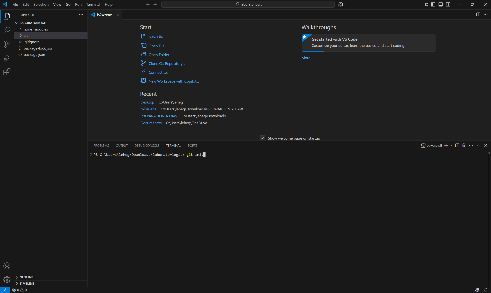

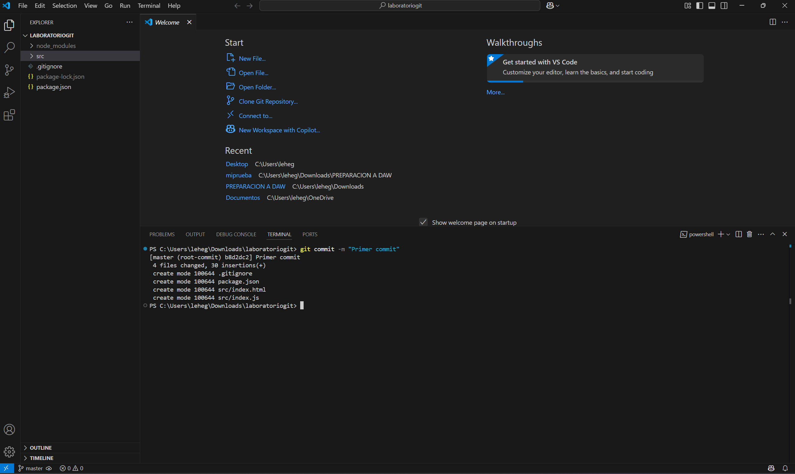

2. ### Subir el repositorio a GitHub

En esta sección creé un repositorio nuevo en GitHub y lo conecté con mi repositorio local.

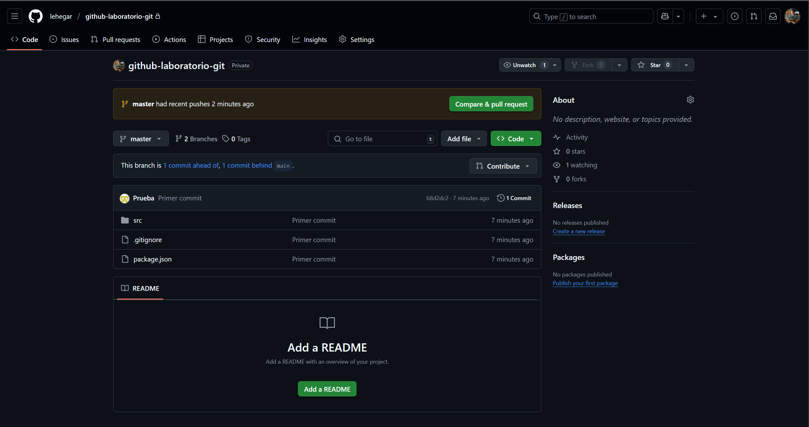

3. ### Hacer un commit y un push

Aquí creé un archivo llamado README y lo hice commit. También añadí un README directamente en GitHub, pero luego lo borré para probar la función de push.

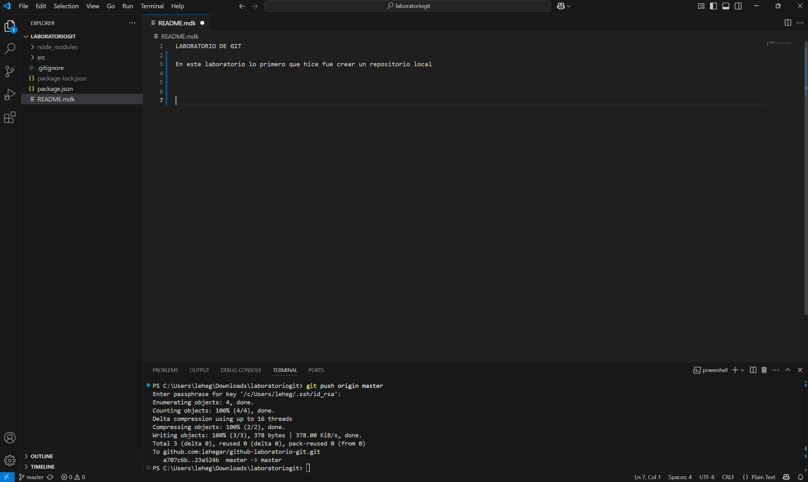

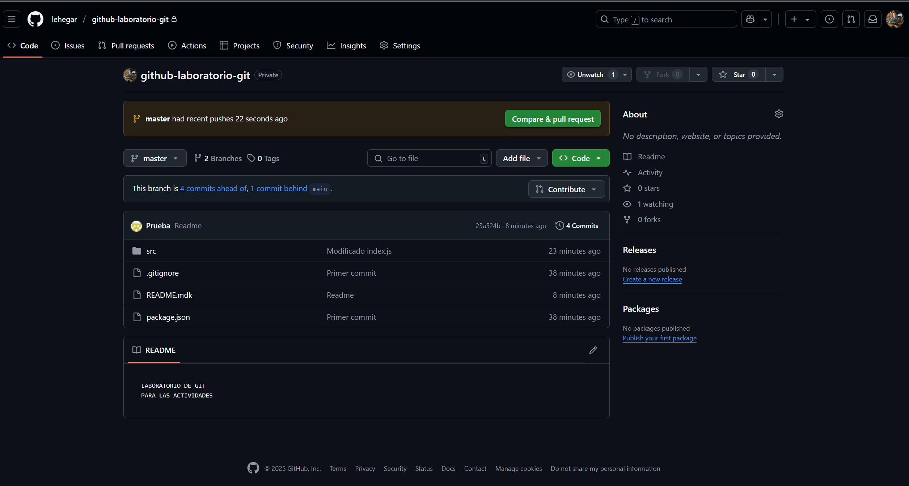

4. ### Crear una rama

Aquí creé una rama llamada development.
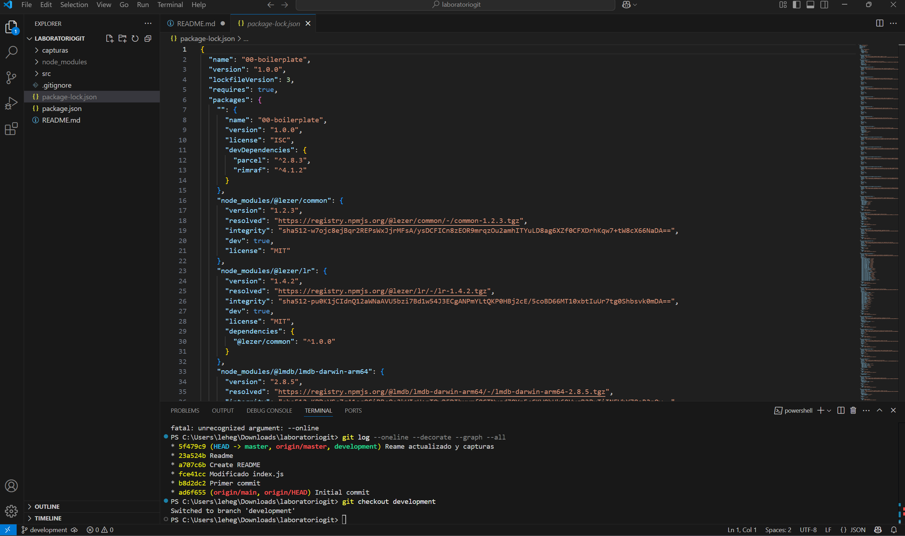

Le añadí también un archivo .txt.
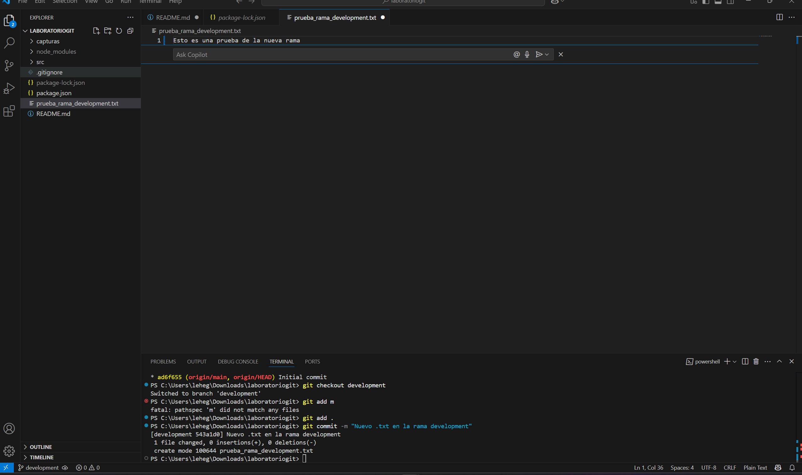

Después lo subí al repositorio en GitHub.
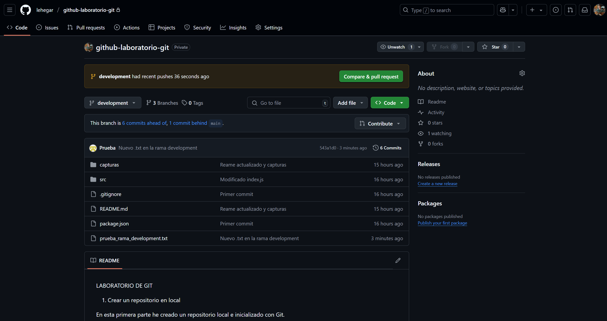

5. ### Hacer un merge

En esta captura se muestra cómo añadí nuevos archivos a la rama development, con el objetivo de hacer un merge con la rama master.

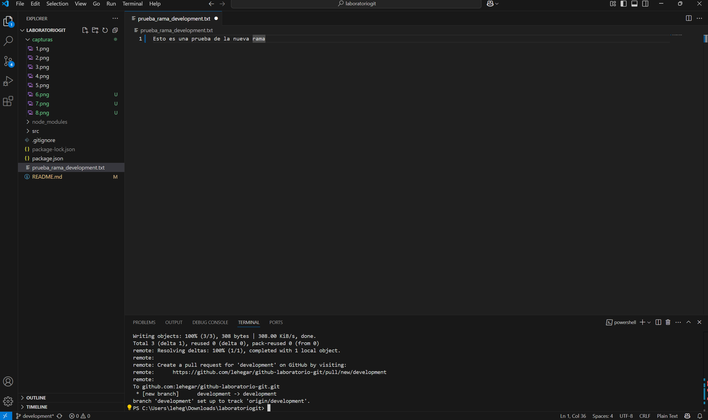

Aquí hice un commit en local.

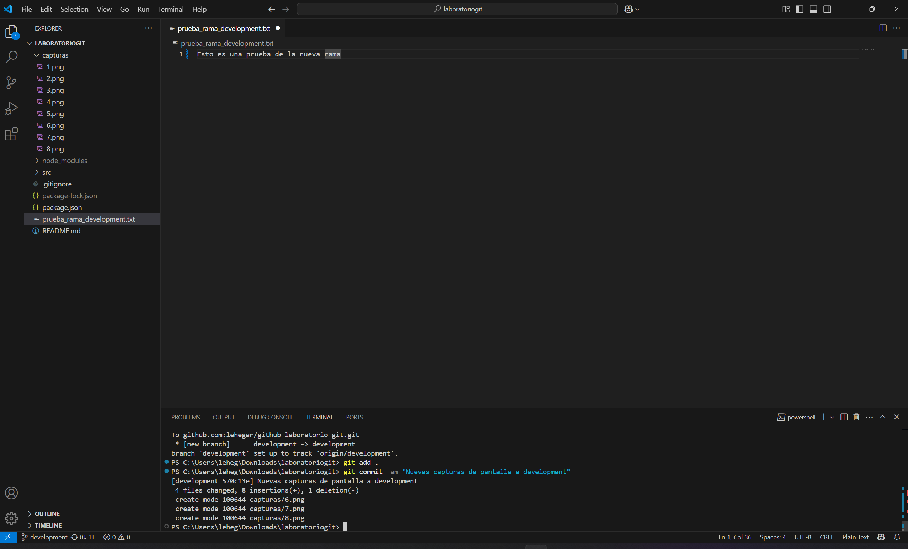

Y aquí realicé el push para subir los cambios a GitHub.

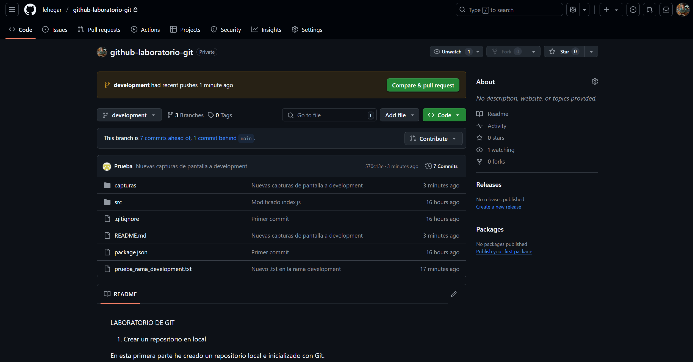
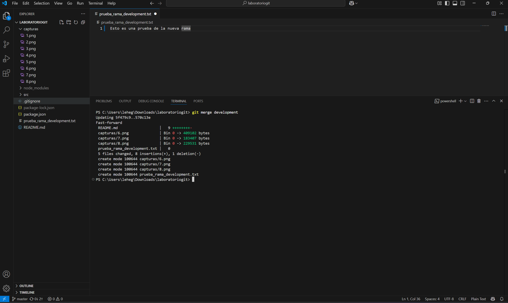

---
